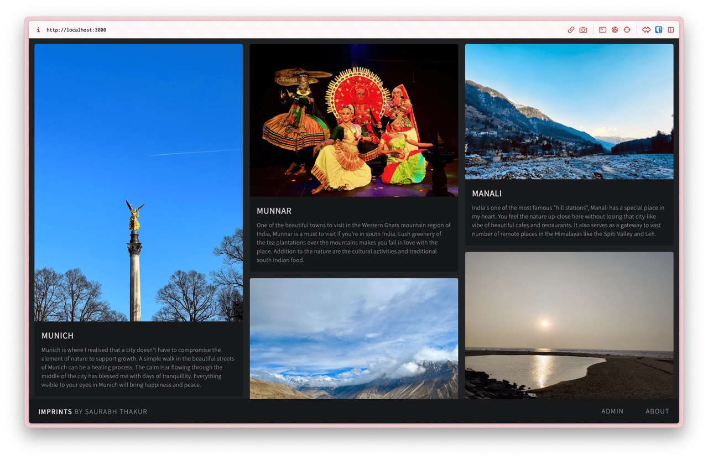
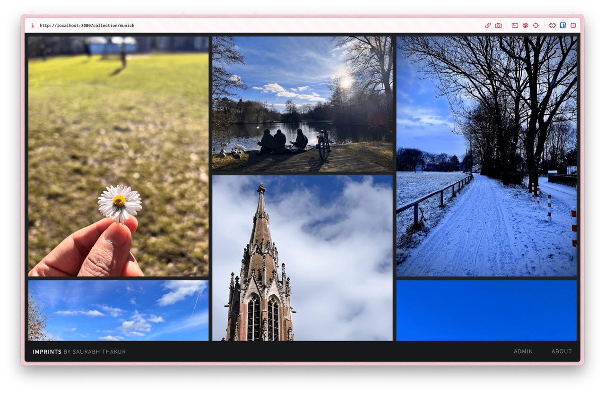
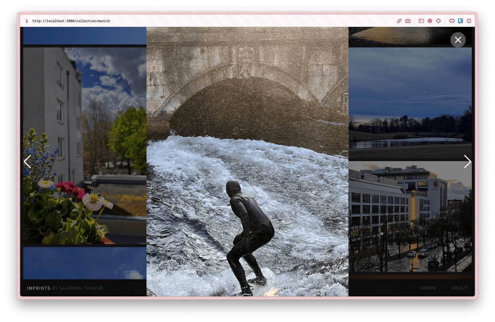
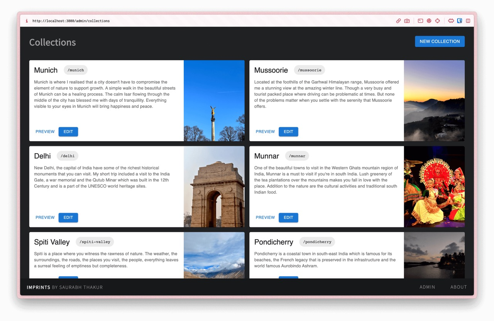
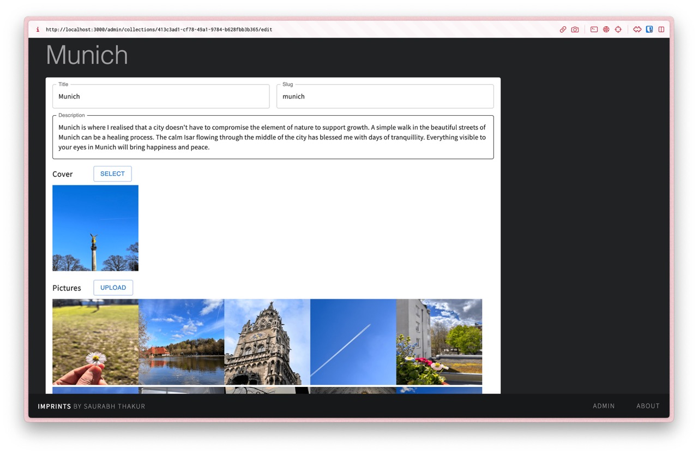
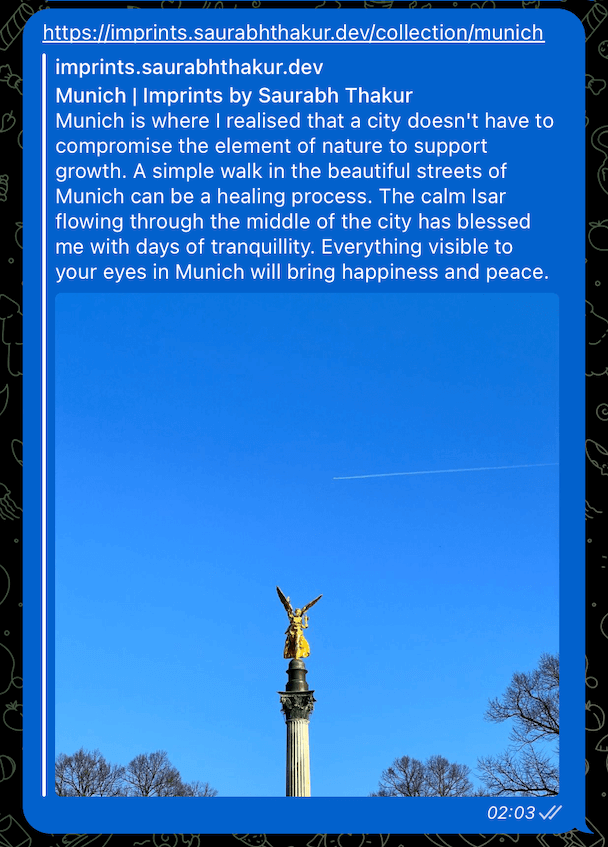
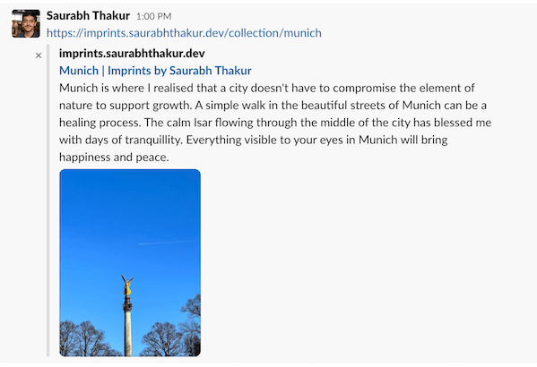

# Imprints

I like to click pictures of moments or things that I always want to keep with me forever and this is a place where I would like to share them with the world. There is a ton of beauty around us and this is my way to share it with the world.

> Personal website and blog [imprints.saurabhthakur.dev](https://imprints.saurabhthakur.dev)

## Deploys

Commits to master and PRs are automatically built and deployed by Netlify

## Features

### Collections

Display a selection of diverse photo collections on the homepage, each presented with an eye-catching cover picture, a descriptive title, and a brief description. Arrange these collections in an aesthetically pleasing yet straightforward collage layout, providing a charming polaroid picture effect

### Collection Photo Collage

This page features a captivating collage of all the pictures within the collection, designed to cover the entire screen in a visually stunning manner. The primary emphasis is on the photographs themselves, which take center stage. Clicking on any of the images allows you to view them in even higher resolution, enhancing their crispness and detail.

### Picture Carousel

The Carousel feature elegantly blurs the background, directing all attention to the individual image at the forefront. Opening an image within the carousel provides the highest possible image quality. You can easily navigate through the images using your keyboard or by simply swiping on touch devices.

### Admin Panel

> Admin Panel is only visible when you run the project locally in development mode.

The recently added admin panel offers a convenient way to manage collections without the need to modify any configuration files or code. You can create and edit albums, set metadata, and preview your changes all in one place.

### Create and Update Collections

While editing a collection, you have the flexibility to update the title, description, and slug. Additionally, you can choose the cover picture from the images already uploaded within the collection.

To rearrange the image order, you can easily drag and drop them within the upload section. As simple as that!

### Link previews for social platforms

Complete support for [Open Graph protocol](https://ogp.me/). Share your collections in style and beauty they deserve.

|                                                                      |                                                                |
| -------------------------------------------------------------------- | -------------------------------------------------------------- |
|  |  |
|    |  |
